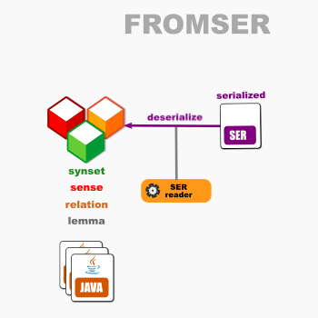

# OEWN model-from-SER

This reads a model from SER files.

Project [fromser](https://github.com/oewntk/fromser)

## Dataflow

## Maven Central

		<groupId>io.github.oewntk</groupId>
		<artifactId>fromser</artifactId>
		<version>2.1.3</version>
